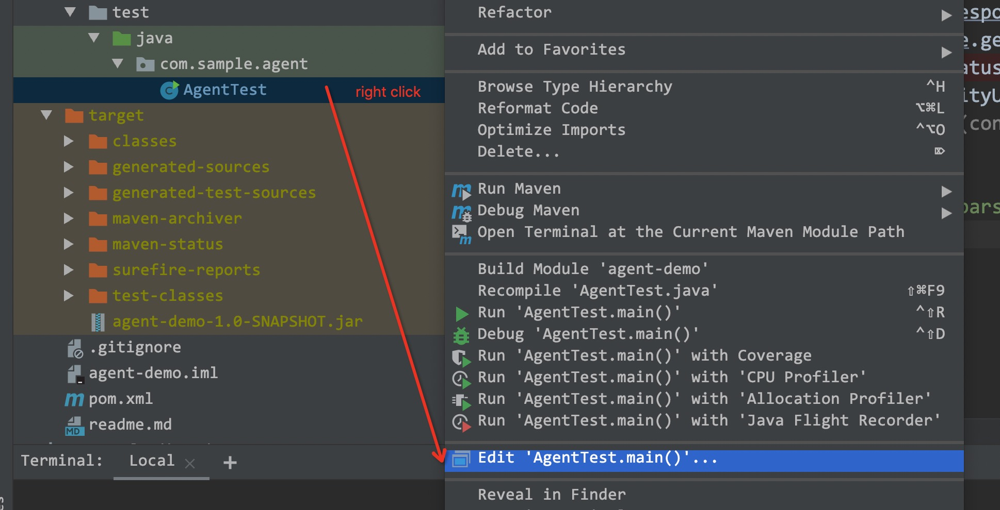

agent entry set:
```xml
<manifestEntries>
    <Premain-Class>com.sample.agent.AgentDemo</Premain-Class>
</manifestEntries>
```

mvn clean install

config vm option(attention your file path):

-javaagent:~/agent-demo-1.0-SNAPSHOT.jar=args



